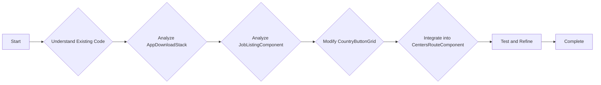

# Adaptation Plan for Country List Component

## 1. Introduction

This document outlines the plan to adapt the `CountryButtonGrid` component in `src/components/country-display.tsx` and the `CentersRouteComponent` in `src/routes/centers/index.tsx` to incorporate a stacking and expandable feature. The goal is to allow multiple centers per country to be displayed in a stacked/expandable manner, potentially using a combobox-like or stacking approach.

## 2. Goals

*   Understand the existing code of `CountryButtonGrid` and `CentersRouteComponent`.
*   Analyze the provided code snippet (`AppDownloadStack`) for stacking and expandable behavior.
*   Analyze the provided code snippet (`JobListingComponent`) for expandable list behavior.
*   Modify the `CountryButtonGrid` to handle multiple centers per country and implement the stacking/expandable UI.
*   Integrate the modified `CountryButtonGrid` into the `CentersRouteComponent` and ensure it works correctly with the existing globe and center details display.

## 3. Plan

### 3.1. Understand Existing Code

*   Read the code of `src/components/country-display.tsx` to understand how `CountryButtonGrid` and `CountryButton` components are implemented.
*   Read the code of `src/routes/centers/index.tsx` to understand how the `CountryButtonGrid` is used within the `CentersRouteComponent`.
*   Identify the data structure used for `iskmCenters` and how it's passed to the `CountryButtonGrid`.

### 3.2. Analyze Provided Code Snippets

*   **AppDownloadStack:** Examine the `AppDownloadStack` component to understand how it implements the stacking and expandable behavior using `motion` and `AnimatePresence`.
*   **JobListingComponent:** Examine the `JobListingComponent` to understand how it implements the expandable list behavior using `motion` and `AnimatePresence`.

### 3.3. Modify `CountryButtonGrid` Component

*   **Data Restructuring:** Restructure the `iskmCenters` data to group centers by country.
*   **Implement Stacking UI:**
    *   Use `motion` and `AnimatePresence` to create the stacking animations for countries.
    *   Adapt the CSS classes from `AppDownloadStack` to style the stacked country buttons.
*   **Implement Expandable List UI:**
    *   Adapt the `JobListingComponent` to create an expandable list of centers for each country.
    *   Display temple name, temple president name (dummy for now), a "Visit Us" blue badge for the map link, dummy social icons, and a dummy address for each center.
    *   Use `motion` and `AnimatePresence` to create the expansion animations for the center details.
    *   Use `useState` and `useOnClickOutside` to manage the active center and close the expanded details when clicking outside.
*   **Handle Center Selection:**
    *   Update the `onCenterSelect` function to handle the selection of a specific center within a country.
    *   Ensure the selected center is highlighted in the UI.

### 3.4. Integrate into `CentersRouteComponent`

*   Replace the existing `CountryButtonGrid` in `CentersRouteComponent` with the modified version.
*   Update the `handleCenterClick` function to work with the new component and data structure.
*   Ensure the globe and center details display are updated correctly when a center is selected.

### 3.5. Test and Refine

*   Test the component thoroughly to ensure the stacking, expansion, and center selection work correctly.
*   Refine the UI and animations to provide a smooth and intuitive user experience.
*   Address any performance issues or bugs that arise during testing.

## 4. Conclusion

This plan provides a detailed roadmap for adapting the country list component with stacking and expandable features. By following these steps, we can create a more user-friendly and visually appealing way to display ISKM centers around the world.